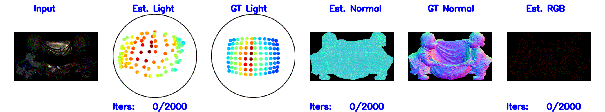
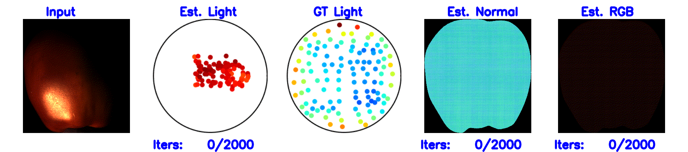
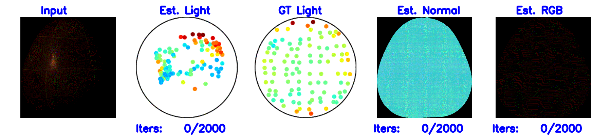
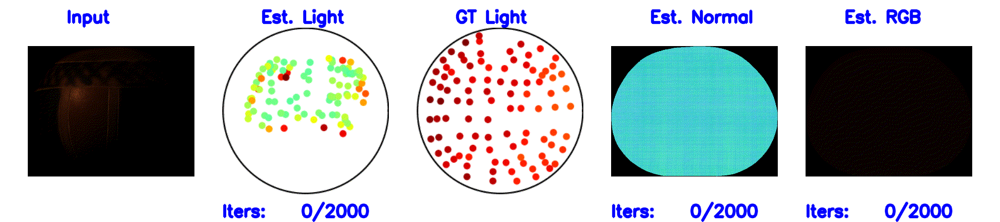
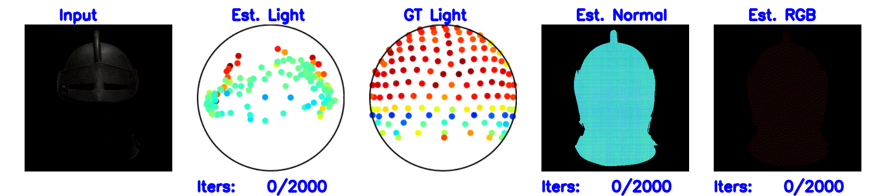
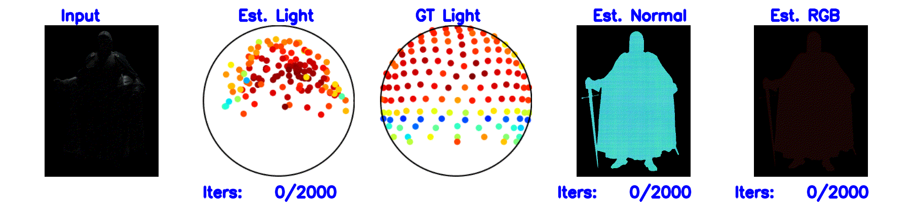

# SCPS-NIR
# Self-calibrating Photometric Stereo by Neural Inverse Rendering
> [Junxuan Li](https://junxuan-li.github.io/), and Hongdong Li. 
> ECCV 2022.
## [Paper](https://arxiv.org/abs/2207.07815)
We proposed a method for Photometric Stereo that
* Introduced a self-supervised neural network for uncalibrated photometric stereo problem. 
* The light sources directions, light intensities, object surface shape and surface reflectance are jointly estimated by the neural network via image reconstruction loss.
* Achieved the **state-of-the-art** methods in surface normal estimation and light estimation compared to prior methods.

**Keywords**: Uncalibrated photometric stereo, inverse rendering, light estimation.

### Results on DiLiGenT main dataset
<p align="center">
    
    
    
</p>


### Results on Apple&Gourd
<p align="center">
    
    
    
</p>

### Results on Light Stage Date Gallery
<p align="center">
    
    
</p>

If you find our code or paper useful, please cite as

    @inproceedings{li2022selfps,
      title={Self-calibrating Photometric Stereo by Neural Inverse Rendering},
      author={Li, Junxuan and Li, Hongdong},
      booktitle={European conference on computer vision},
      year={2022},
      organization={Springer}
    }

## Dependencies

First, make sure that all dependencies are in place. We use [anaconda](https://www.anaconda.com/) to install the dependencies.

To create an anaconda environment called `scps_nir`, run
```
conda env create -f environment.yml
conda activate scps_nir
```

## Quick Test on DiLiGenT main dataset
Our method is tested on the [DiLiGenT main dataset](https://sites.google.com/site/photometricstereodata/single?authuser=0).

To reproduce the results in the paper, we have provided [pre-computed models](https://www.dropbox.com/s/dws5u3984uw942s/precomputed_models.zip) for quick testing. Simply run
```
bash configs/download_precomputed_models.sh
bash configs/test_precomputed_models.sh
```
The above scripts should create output folders in `runs/diligent/`. The results are then available in `runs/diligent/*/est_normal.png` for visualization.

## Train from Scratch 

### DiLiGenT Datasets

First, you need to download the [DiLiGenT main dataset](https://sites.google.com/site/photometricstereodata/single?authuser=0) and unzip the data to this folder `data/DiLiGenT/`.

After you have downloaded the data, run
```
python train.py --config configs/diligent/reading.yml
```
to test on each object. You can replace `configs/diligent/reading.yml ` with to other `yml` files for testing on other objects.

Alternatively, you can run
```
bash configs/train_from_scratch.sh
```
This script will run and test all the 10 objects in `data/DiLiGenT/pmsData/*` folder. And the output is stored in `runs/diligent/*`.


### Gourd&amp;Apple dataset

The [Gourd&amp;Apple dataset](http://vision.ucsd.edu/~nalldrin/research/cvpr08/datasets/) dataset can be downloaded in [here](http://vision.ucsd.edu/~nalldrin/research/cvpr08/datasets/). Then, unzip the data to this folder `data/Apple_Dataset/`.

After you have downloaded the data, please run

```
python train.py --config configs/apple/apple.yml 
```
to test on each object. You can replace `configs/apple/apple.yml ` with to other `yml` files for testing on other objects.

### Using Your Own Dataset

If you want to train a model on a new dataset, you can follow the python file `load_diligent.py` to write your own dataloader.

## Acknowledgement
Part of the code is based on [Neural-Reflectance-PS](https://github.com/junxuan-li/Neural-Reflectance-PS), [nerf-pytorch](https://github.com/krrish94/nerf-pytorch), [UPS-GCNet
](https://github.com/guanyingc/UPS-GCNet), [SDPS-Net](https://github.com/guanyingc/SDPS-Net) repository.

## Citation
If you find our code or paper useful, please cite as

    @inproceedings{li2022selfps,
      title={Self-calibrating Photometric Stereo by Neural Inverse Rendering},
      author={Li, Junxuan and Li, Hongdong},
      booktitle={European conference on computer vision},
      year={2022},
      organization={Springer}
    }
